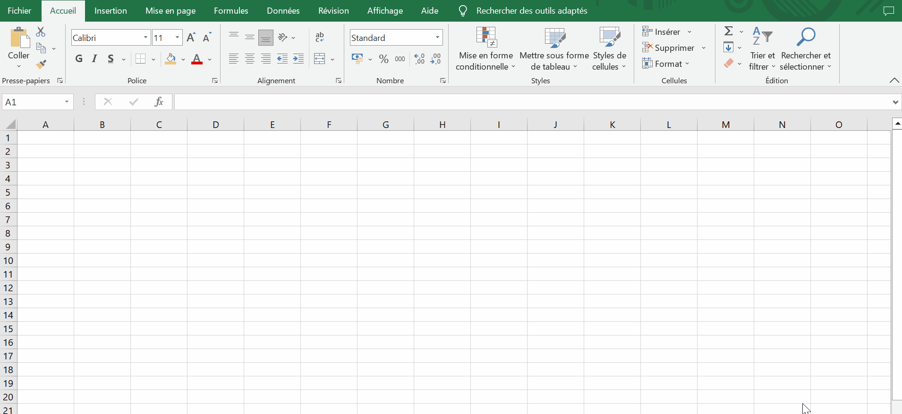

## Pré requis
Pour effectuer ce TP vous devriez installer microsoft excel.   
Les données qui seront analysées sont sur le site de la SNCF. https://ressources.data.sncf.com/explore/?sort=modified   

## Téléchargement du fichier

https://github.com/elomedah/iris-big-data/raw/98872a7468f60a0cfb900d7f654b9e6dfd1ec0b1/TP-data-viz-excel/objets-trouves-restitution.zip 

## Importer un fichier csv dans excel

## Construire un TCD (Tableau croisé dynamique)

## Quelle est la différence entre une dimension et une mesure 

## Analyse de données

- Combien de lignes  il-y-a dans le fichier ?
- Quelles sont les 5 gares les plus impactées ?
- Quel jour il y a eu plus d'objects perdus ?
- Quelle est la nature de l'object le plus perdus ?
- Quel mois de l'année il y a le plus d'objects perdus ?
- Si vous étiez Responsable des objets perdus SNCF dans quelle région allez-vous investir en priorité pour lutter contre la perte des objets ?
- Tous les objets retrouvés sont-ils rendus ? Si oui pourquoi ? Sinon combien d'objets retrouvés n'ont pas été rendus ?
