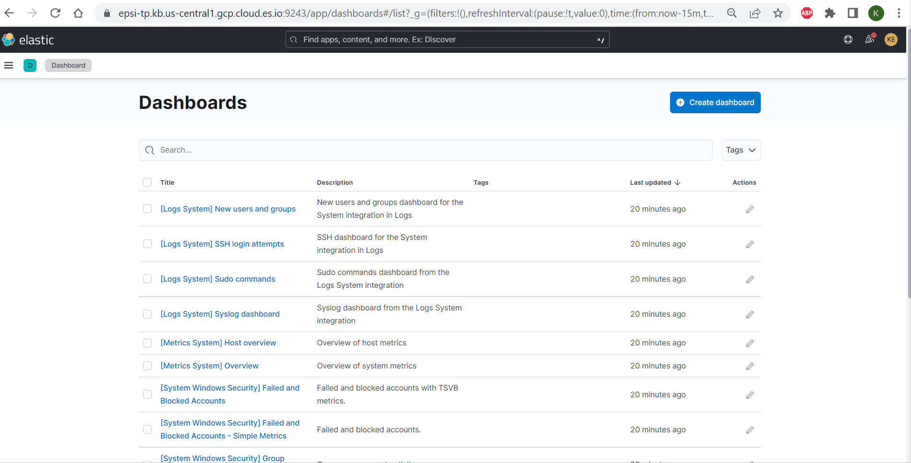

# TP ELK SIEM
## Pré requis
- Installer la machine virtuelle ubuntu ou télécharger la machine ubuntu virtualBox (https://ubuntu.com/tutorials/how-to-run-ubuntu-desktop-on-a-virtual-machine-using-virtualbox#1-overview)
- Lire la description de la stack ELK
- Il est possible également de faire le TP sur Windows. Mais pour des raisons des simplicité je préconise fortement l'image ubuntu
- Il est possible également d'utiliser la version cloud d'ELK
- 
## Installation de ELK

### Installer ElasticSearch
Pour installer ElasticSearch vous pouvez suivre les étapes sur la page officielle d'elasticsearch : https://www.elastic.co/guide/en/elasticsearch/reference/current/install-elasticsearch.html 

Pour installer avec la machine virtuelle ubuntu : https://www.elastic.co/guide/en/elasticsearch/reference/current/targz.html 
Pour vérifier que Elasticsearch est bien demarré en local : https://localhost:9200
### Installer kibana
Pour installer ElasticSearch vous pouvez suivre les étapes sur la page officielle d'elasticsearch : https://www.elastic.co/fr/downloads/kibana

Pour vérifier que kibana est bien demarré en local : http://localhost:5601

### Utiliser la version cloud de ELK 
Vous pouvez également utiliser la version cloud de la stack ELK : https://cloud.elastic.co/registration 

## Collecter les logs en centralisant sur Elasticsearch

### Collecter les données du système
#### Installer l'agent Elastic
Pour exporter les logs syslog dans ELK, http://localhost:5601    
Aller sur le menu Home :  http://localhost:5601/app/home#/    
Choisir l'option Security    
Cliquer sur "Add Integrations"     
Chercher "System"    
Choisir l'option Install Elastic Agent    

```
sudo apt install curl
curl -L -O https://artifacts.elastic.co/downloads/beats/elastic-agent/elastic-agent-8.4.0-linux-x86_64.tar.gz
tar xzvf elastic-agent-8.4.0-linux-x86_64.tar.gz
cd elastic-agent-8.4.0-linux-x86_64
sudo ./elastic-agent install --url=serverElasticHere --enrollment-token=CopierVotreCode
```

Pour savoir les composants de l'agent elastic consulter la documentation officielle : https://www.elastic.co/fr/beats/ 

#### Découvrir les différents dashboard
Plusieurs dashboard pré-configurés sont déjà disponible. 




#### Ajouter une nouvelle source de données pour collecter les modifications sur les fichiers sensibles
Les fichiers logs sont très importants. Il est donc capital de monitorer tout type d'action sur ces fichiers sur le serveurs.


## Configuration des règles

#### Précharger les règles prédefinies de ELK


#### Créer sa propre règle basée sur une règle prédefinie


#### Tester la règle


## A vous de jouer

L'exercice de l'atelier qui sera noté consistera à :   
- chercher une règle prédefinie https://www.elastic.co/guide/en/security/current/detection-engine-overview.html
- configurer la règle 
- présenter la règle (MITRE ATT&CK)
- Tester la violation de la règle pour constater l'alerte

